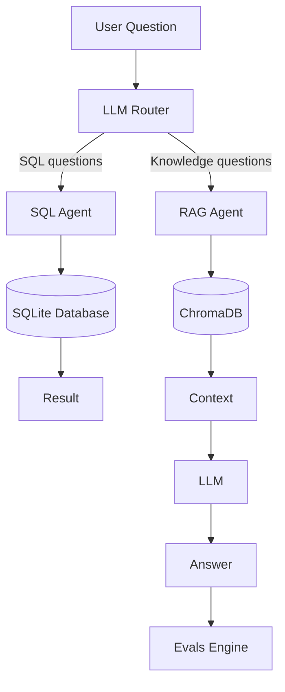
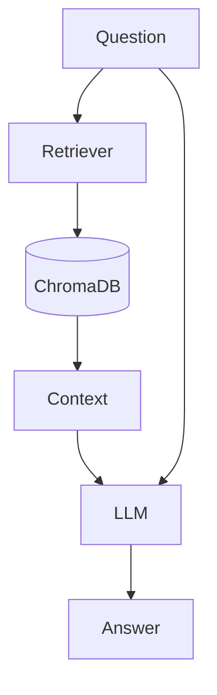
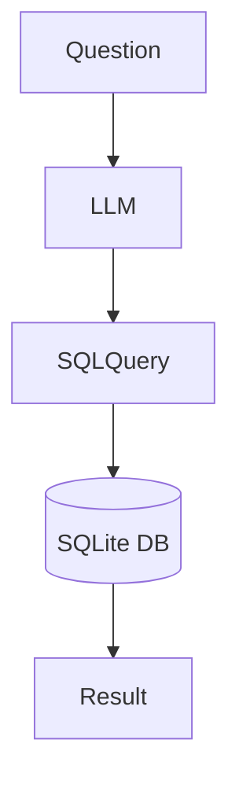

# AI Evals

AI Evals is a small experimental framework that demonstrates how **LLM systems can route questions to specialized agents and evaluate their responses**.

The system includes:

- **RAG agent** – retrieves information from documents and generates answers
- **SQL agent** – converts natural language to SQL and queries a database
- **LLM router** – decides which agent should handle a question
- **Evaluation engine** – detects hallucinations in responses

---

## Architecture



---

## RAG Flow



---

## SQL Agent Flow



---

## Setup

Install dependencies:

```bash
pip install -r requirements.txt
```

Create `.env` file:

```
GOOGLE_API_KEY=your_api_key
```

---

## Initialize Database

```bash
python scripts/setup.py
```

---

## Ingest Documents

```bash
python scripts/ingest.py
```

---

## Run the System

```bash
python run_pipeline.py
```

Example:

```
Ask a question: Who invented Python?
```

---

## SQL Example

```
Question: How many users signed up in February?
```

Generated SQL:

```sql
SELECT COUNT(*) FROM users
WHERE signup_date LIKE '2024-02%';
```

---

## Run Evaluation

```bash
python pipelines/run_evals.py
```

Results will be saved in:

```
results/
```

---

## Tech Stack

- Python
- Gemini API
- ChromaDB
- SQLite
- Sentence Transformers
